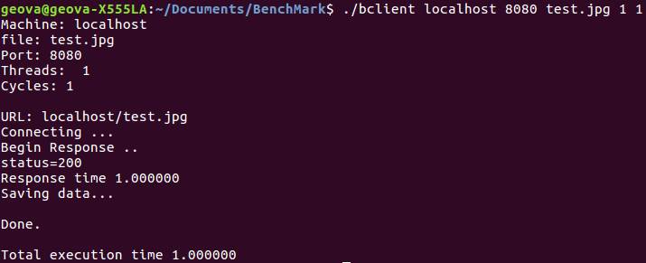

# Operating Systems Project

#### Pablo Rodriguez
#### Diego Jimenez
#### Geovanny Espinoza Quiros-201404508


# Introduction 

Lorem Ipsum
```c
void web(int fd, int hit)
{
	int j, file_fd, buflen, len;
	long i, ret;
	char * fstr;
	static char buffer[BUFSIZE+1];
}
```
# BenchMarks
For all the benchmarks we use this link to convert [CSV to Markdown](https://donatstudios.com/CsvToMarkdownTable)

## WebServer Sequential version Example.
##### Run the following line on linux terminal
###### ./ bclient 192.168.100.2 8002 movie.iso 3 10
##### The following data shows an example of the response after execute the line mention above.
#
#
#

|          Params          |       Result           | 
---------------------------|------------------| 
| WebServerName             | 192.168.100.2    | 
| WebServerNameRequest      |  192.168.100.201 | 
| RequestId                 | 01               | 
| WebServerMechanism        | Sequential       | 
| Initial request time      | 10ms             | 
| The kind of file          | iso              | 
|  The file size            |  500Mb           | 
| The response time         |  300ms           | 
| Amount of requests        |  30              | 
| Average response time     |  50ms            | 
| Time transfering the file |  48s             | 

#
#
#
## WebServer Forked version Example.
##### Run the following line on linux terminal
###### ./ bclient 192.168.100.10 8010 file.zip 3 10
##### The following data shows an example of the response after execute the line mention above.
##### The response time is going to depends of the heavyweight
#
#
|          Params          |       Result           | 
|---------------------------|------------------| 
| WebServerName             |  192.168.100.2   | 
| WebServerNameRequest      |  192.168.100.202 | 
| RequestId                 |  02              | 
| WebServerMechanism        |  Forked          | 
| Initial request time      |  20ms            | 
| The kind of file          |  zip             | 
|  The file size            |  300Mb           | 
| The response time         |  30ms            | 
| Amount of requests        |  20              | 
| Average response time     |  60ms            | 
| Time transfering the file |  28s             | 

## WebServer Threaded version
##### Run the following line in the terminal
###### ./ bclient 192.168.100.20 8020 picture.png 5 6
##### The following data shows an example of the response after execute the line mention above.
##### The response time is going to depends of the light-weight process
#
#

|          Params          |       Result           |
|---------------------------|------------------| 
| WebServerName             |  192.168.100.20  | 
| WebServerNameRequest      |  192.168.100.203 | 
| RequestId                 |  03              | 
| WebServerMechanism        |  Threaded        | 
| Initial request time      |  5ms             | 
| The kind of file          |  png             | 
|  The file size            |  10Mb            | 
| The response time         |  2ms             | 
| Amount of requests        |  30              | 
| Average response time     |  10ms            | 
| Time transfering the file |  8s              | 

#

## WebServer Pre-fork version
##### Run the following line in the terminal
###### ./ bclient 192.168.100.30 8030 text.txt 2 3
##### The following data shows an example of the response after execute  the line mention above.
##### The response time is going to depends of the workers
#
#

|          Params           |       Result     |
|---------------------------|------------------| 
| WebServerName             |  192.168.100.30  | 
| WebServerNameRequest      |  192.168.100.204 | 
| RequestId                 |  04              | 
| WebServerMechanism        |  Pre-fork        | 
| Initial request time      |  20ms            | 
| The kind of file          |  txt             | 
| The file size             |  1Mb             | 
| The response time         |  1ms             | 
| Amount of requests        |  6               | 
| Average response time     |  3ms             | 
| Time transfering the file |  2s              | 

#
#

## WebServer Pre-threaded version
##### Run the following line in the terminal
###### ./ bclient 192.168.100.40 8040 file.tar.gz 8 2
##### The following data shows an example of the response after execute the line mention above.
##### The response time is going to depends of the workers

#
#

|          Params           |       Result     |
|---------------------------|------------------| 
| WebServerName             |  192.168.100.40  | 
| WebServerNameRequest      |  192.168.100.205 | 
| RequestId                 |  05              | 
| WebServerMechanism        |  Pre-threaded    | 
| Initial request time      |  50ms            | 
| The kind of file          |  tar.gz          | 
| The file size             |  1Gb             | 
| The response time         |  50ms            | 
| Amount of requests        |  16              | 
| Average response time     |  3ms             | 
| Time transfering the file |  300s            | 


<div style="text-align:center"></div>



# Students Activity Logs
### TimeTable for Pablo Rodriguez
[Utilizen esto para crear las tablas](https://www.tablesgenerator.com/markdown_tables)

| Tarea      	| Dia      	| Cantidad de horas 	|
|------------	|----------	|-------------------	|
| Documentar 	| 0.000011 	| 0.000005          	|
| Programar  	| 0.000024 	| 0.000047          	|
| Etc...     	| 0.000117 	| 0.000093          	|


### TimeTable for Geovanny Espinoza Quiros


| Activity                                                      |  Date            |  Hours | 
|---------------------------------------------------------------|------------------|--------| 
| Review and Analise the specification document                 |  22-3-19         |  2     | 
| Benchmark and CSV research                                    |  23-3-19         |  1.5   | 
| Create and exampSle of benchmarks: Sequential-Forked-Threaded |  24-3-19         |  2     | 
| Create more examples of benchmarks: Pre-fork and Pre-threaded |  25-3-19         |  1     | 
| First phase document elaboration                              |  26-3-19         |  1.5   |
| Build the first benchmark code release                        |  26-3-19/28-3-19 |  8     | 
| Total hours:                                                  |  19-3-19/26-3-19 |  16    | 


# References

